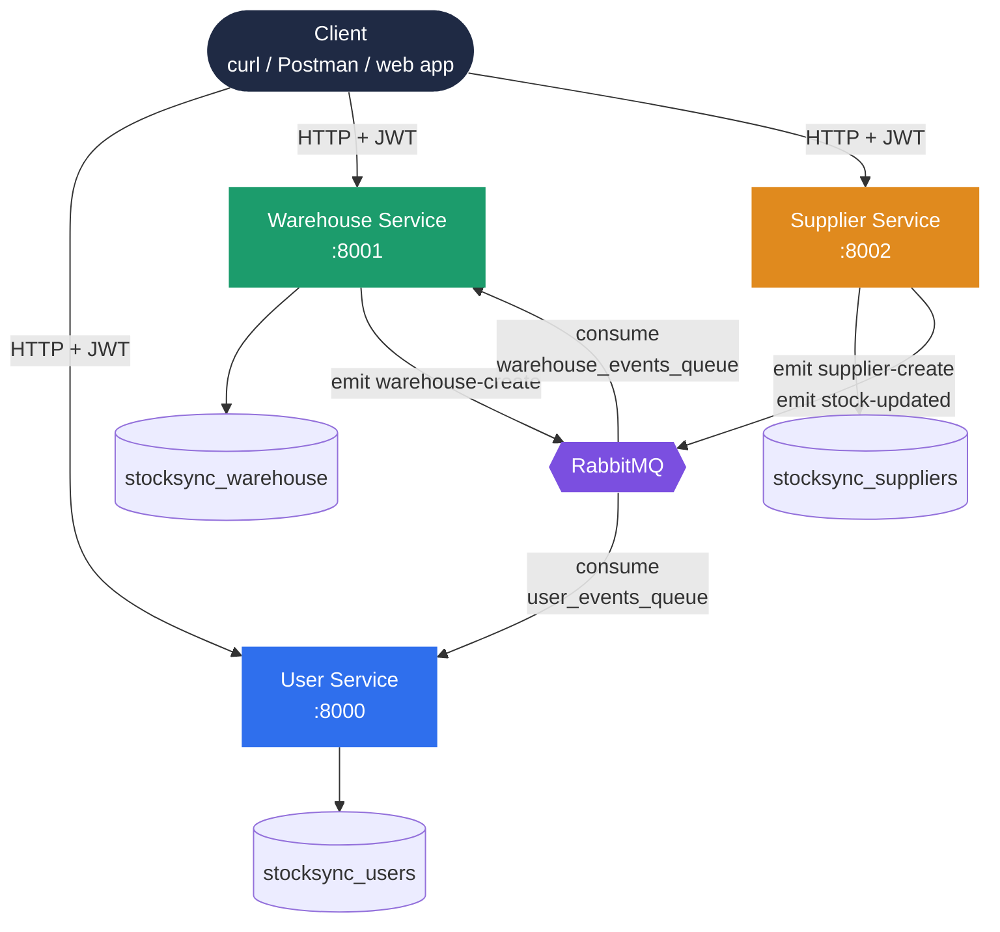
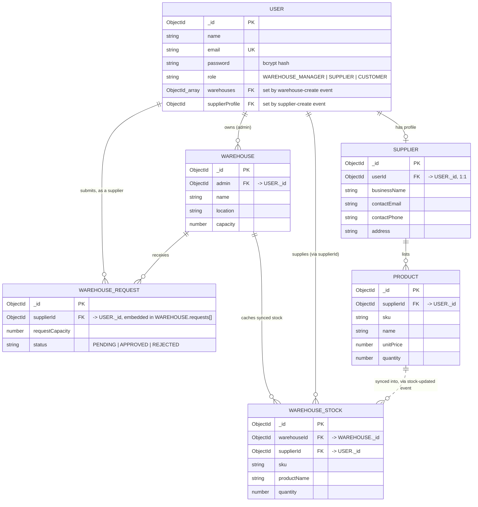
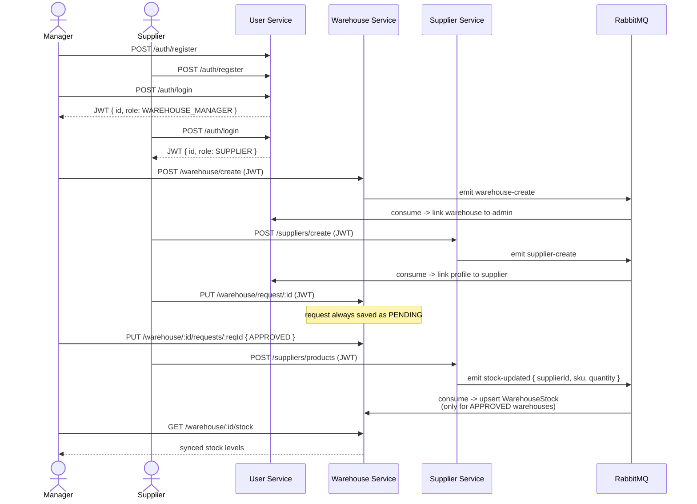

# StockSyncServices

A microservice-based inventory platform built with NestJS. Three independently-deployable
services — **user-service**, **warehouse-service**, and **supplier-service** — each own a
private MongoDB Atlas database and coordinate over RabbitMQ, so a supplier's stock levels stay
automatically synced into every warehouse that has approved them.

| Service | Port | Owns | Responsibility |
|---|---|---|---|
| [`user-service`](user-service) | 8000 | `stocksync_users` | Registration, login (JWT), linking warehouses/supplier profiles onto a user |
| [`warehouse-service`](warehouse-service) | 8001 | `stocksync_warehouse` | Warehouses, supplier capacity requests, synced stock |
| [`supplier-service`](supplier-service) | 8002 | `stocksync_suppliers` | Supplier profiles, products |

---

## Architecture

Every client request hits one of the three services directly (there's no API gateway yet).
Each service owns its own database — no service reads another's collections. The **only**
cross-service communication is asynchronous, over two RabbitMQ queues.



**Why events instead of a direct HTTP call?** When warehouse-service creates a warehouse,
user-service needs to know so it can link the warehouse to the admin's account — but
warehouse-service shouldn't have to know user-service's address, retry logic, or be blocked
waiting on it. Publishing `warehouse-create` and moving on keeps the services decoupled: if
user-service is briefly down, the message just waits durably in the queue.

### Design principles

- **Database per service** — no service reads another's collections directly.
- **Events, not synchronous calls, for cross-service writes** — a fact is published to
  RabbitMQ; the owning service applies it.
- **One identity, shared by reference** — the Mongo `_id` a user gets from user-service is the
  same id used everywhere as `admin`, `supplierId`, and `userId` across the other two services
  and inside every JWT.
- **Independent deployability over shared code** — the JWT/roles guards are intentionally
  duplicated per service rather than pulled into a shared library, so each service can still be
  built, tested, and deployed on its own.

---

## Entity-relationship diagram

Three separate databases, linked only by the `ObjectId`s they pass around in events and JWTs —
there are no real foreign-key constraints across a database boundary, only application-level
consistency.



| Database | Collections |
|---|---|
| `stocksync_users` | `users` |
| `stocksync_warehouse` | `warehouses` (with embedded `requests[]`), `warehousestocks` |
| `stocksync_suppliers` | `suppliers`, `products` |

`WAREHOUSE_REQUEST` isn't a real collection — it's the `requests[]` array embedded inside each
`Warehouse` document. It's drawn as its own entity above only to make the relationship to
`USER` (the requesting supplier) and its lifecycle (`PENDING → APPROVED/REJECTED`) explicit.

---

## Complete workflow

One full pass through the pipeline, in the order a client actually calls it:



| # | Step | Service | Endpoint | What happens |
|---|---|---|---|---|
| 1 | Register | User | `POST /auth/register` | Manager & supplier accounts created; password hashed with bcrypt. |
| 2 | Log in | User | `POST /auth/login` | Returns a JWT carrying `{id, email, role}` — sent as `Bearer` token on every call below. |
| 3 | Create warehouse | Warehouse | `POST /warehouse/create` | Saves the warehouse, emits `warehouse-create` → RabbitMQ. |
| 4 | Create supplier profile | Supplier | `POST /suppliers/create` | Saves the profile, emits `supplier-create` → RabbitMQ. |
| 5 | Request capacity | Warehouse | `PUT /warehouse/request/:id` | Supplier asks to stock a warehouse; always stored as `PENDING`. |
| 6 | Approve / reject | Warehouse | `PUT /warehouse/:id/requests/:reqId` | Only the manager can flip a request to `APPROVED`/`REJECTED`. |
| 7 | Add / update product | Supplier | `POST /suppliers/products` · `PUT .../quantity` | Saves the product, emits `stock-updated` → RabbitMQ. |
| 8 | Stock sync (event-driven) | Warehouse | `@EventPattern('stock-updated')` | Finds every warehouse with an `APPROVED` request from that supplier and upserts its `WarehouseStock` row. |
| 9 | View synced stock | Warehouse | `GET /warehouse/:id/stock` | Manager sees live per-supplier stock — no direct call to Supplier Service needed. |

---

## API reference

### user-service — port 8000
| Method | Endpoint | Auth | Purpose |
|---|---|---|---|
| POST | `/auth/register` | — | Create a user (`name`, `email`, `password`, `role`). |
| POST | `/auth/login` | — | Verify credentials, return a JWT. |

### warehouse-service — port 8001
| Method | Endpoint | Role | Purpose |
|---|---|---|---|
| GET | `/warehouse/get` | `WAREHOUSE_MANAGER` | List warehouses owned by the caller. |
| POST | `/warehouse/create` | `WAREHOUSE_MANAGER` | Create a warehouse. |
| PUT | `/warehouse/request/:warehouseId` | `SUPPLIER` | Request capacity (always saved as `PENDING`). |
| PUT | `/warehouse/:warehouseId/requests/:requestId` | `WAREHOUSE_MANAGER` | Approve or reject a request. |
| GET | `/warehouse/:warehouseId/stock` | `WAREHOUSE_MANAGER` | View synced stock for that warehouse. |

### supplier-service — port 8002
| Method | Endpoint | Role | Purpose |
|---|---|---|---|
| POST | `/suppliers/create` | `SUPPLIER` | Create the caller's supplier profile. |
| GET | `/suppliers/get` | `SUPPLIER` | Fetch the caller's supplier profile. |
| POST | `/suppliers/products` | `SUPPLIER` | Add a product (emits `stock-updated`). |
| GET | `/suppliers/products` | `SUPPLIER` | List the caller's products. |
| PUT | `/suppliers/products/:productId/quantity` | `SUPPLIER` | Update quantity (emits `stock-updated`). |

---

## Event catalogue

| Event | Producer | Queue | Consumer | Payload |
|---|---|---|---|---|
| `warehouse-create` | warehouse-service | `user_events_queue` | user-service | `{ warehouseId, userId }` |
| `supplier-create` | supplier-service | `user_events_queue` | user-service | `{ supplierProfileId, userId }` |
| `stock-updated` | supplier-service | `warehouse_events_queue` | warehouse-service | `{ supplierId, sku, productName, quantity }` |

All three are fire-and-forget (`ClientProxy.emit`, not `send`) — the publisher never waits for
or depends on the consumer. Handlers log and swallow their own errors so one bad event can never
crash the listening service.

---

## Configuration

Every service loads its own `.env` via `@nestjs/config` — nothing is hardcoded in source.
`.env` is git-ignored; `.env.example` is committed as a template.

| Variable | Meaning |
|---|---|
| `PORT` | HTTP port for that service (8000 / 8001 / 8002). |
| `MONGO_URI` | That service's own Atlas connection string — a different database name per service. |
| `JWT_SECRET` | Shared across all three services so a token minted by user-service verifies everywhere. |
| `JWT_EXPIRES_IN` | Token lifetime (default `1h`). |
| `RABBITMQ_URL` | e.g. `amqp://localhost:5672` — add `?frameMax=8192` if your broker is RabbitMQ 4.x. |
| `USER_EVENTS_QUEUE` | Queue user-service listens on; warehouse/supplier-service publish to it. |
| `WAREHOUSE_EVENTS_QUEUE` | Queue warehouse-service listens on; supplier-service publishes to it. |

---

## Running it

### Option A — Docker Compose
```bash
docker compose up --build
```
Starts RabbitMQ plus all three services, wired to their own `.env` files. MongoDB stays on
Atlas — it isn't containerized.

### Option B — run each service directly
Requires a reachable RabbitMQ (locally via Homebrew: `brew services start rabbitmq`).
```bash
cd user-service && npm run start:dev        # port 8000
cd warehouse-service && npm run start:dev   # port 8001
cd supplier-service && npm run start:dev    # port 8002
```

---

## Testing

```bash
cd user-service && npm test        # 22 tests
cd warehouse-service && npm test   # 20 tests
cd supplier-service && npm test    # 18 tests
```
All Mongo models and RabbitMQ `ClientProxy` instances are mocked — `npm test` never touches a
real database or broker.

---

## Future roadmap

Deliberately out of scope for this pass:

- Refresh tokens + token blacklist/revocation.
- Rate limiting on auth endpoints.
- A notification-service reacting to stock-sync and approval events.
- Structured logging and health-check endpoints per service.
- CI (GitHub Actions) running lint + test on every push.
- An API gateway or documented single entry point for clients.
- Revisit shared-library vs. per-service duplication for the JWT/roles guards as the team grows.
